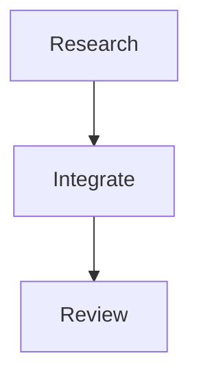

# AgentX

AgentX is a policy and orchestration plugin for running multi-agent work on top
of Orca ADE. It lets a repository declare an orchestration graph in Mermaid,
validate the graph, compile it into a deterministic task manifest, and then
materialize that manifest into Orca Runs, Tasks, and gates.

AgentX owns policy. Orca owns execution.

## What AgentX does

- Validates repository-stored Mermaid DAG files with strict `%%@agentx` policy
  metadata.
- Compiles a DAG into a stable manifest and digest that can be reviewed before
  any runtime mutation.
- Materializes an approved graph into Orca with deterministic request ids and a
  private journal for recovery.
- Provides policy helpers for gates, artifacts, message routing, failed
  descendants, and exact fallback decisions.
- Keeps the existing `agentx:delivery` workflow available for software delivery
  tasks.

## What AgentX does not do

- It does not replace Orca scheduling, terminals, workers, worktrees, messaging,
  or lifecycle state.
- It does not provide a visual graph editor.
- It does not store or proxy provider credentials.
- It does not run live provider or recovery probes unless explicitly approved.

## Requirements

- Node.js 18 or newer.
- Orca ADE with the CLI registered and orchestration enabled.
- A supported harness when using delivery workflows: Claude Code, Codex CLI,
  Cursor Agent CLI, or OMP.

Check Orca first:

```bash
orca open
orca status --json
orca orchestration run-list --json
```

## Install

The plugin is published from:

```text
https://github.com/ntluong95/agentx.git
```

### Claude Code

```bash
claude plugin marketplace add https://github.com/ntluong95/agentx.git
claude plugin install agentx@agentx
claude plugin list
```

### Codex CLI

```bash
codex plugin marketplace add https://github.com/ntluong95/agentx.git
codex plugin add agentx@agentx
codex plugin list
```

To refresh a Codex install, use:

```bash
codex plugin marketplace upgrade
```

### Cursor Agent CLI

```bash
cursor-agent plugin marketplace add https://github.com/ntluong95/agentx.git
cursor-agent plugin marketplace list
```

Then open `/plugin` in Cursor Agent, choose `agentx` from the marketplace, and
install it.

### OMP

Use a dedicated clone or a git archive snapshot. Avoid installing from a working
checkout that you continue editing.

```bash
git clone https://github.com/ntluong95/agentx.git agentx
omp plugin install /path/to/agentx
omp plugin list --json
omp skill list --json
```

## Use the delivery workflow

In a repository where AgentX is installed:

1. Run `agentx:setup` if you want to write harness/model/effort pins into
   `AGENTS.md`.
2. Run `agentx:delivery` for a software delivery task.
3. Approve the design contract when AgentX asks.
4. Let AgentX dispatch implementation and review through Orca.

The delivery workflow uses Orca orchestration and the helper under
[`skills/delivery/scripts/agentx.js`](skills/delivery/scripts/agentx.js).
The detailed workflow contract lives in
[`skills/delivery/SKILL.md`](skills/delivery/SKILL.md).

## Use repository graph mode

Graph mode is explicit. Existing delivery behavior does not use graph mode
unless you choose it.

Create a Mermaid flowchart in the repository:



Validate and compile it without mutating Orca:

```bash
skills/delivery/scripts/agentx validate-graph --graph path/to/workflow.mmd
skills/delivery/scripts/agentx compile-graph --graph path/to/workflow.mmd
```

Prepare a deterministic materialization ledger without mutating Orca:

```bash
mkdir -m 700 .agentx-journal
skills/delivery/scripts/agentx materialize-graph \
  --graph path/to/workflow.mmd \
  --journal .agentx-journal/workflow.json \
  --orca /absolute/path/to/orca \
  --dry-run
```

Run live materialization only in an approved or disposable environment:

```bash
skills/delivery/scripts/agentx materialize-graph \
  --graph path/to/workflow.mmd \
  --journal .agentx-journal/workflow.json \
  --orca /absolute/path/to/orca
```

The journal directory must be private. AgentX records deterministic Orca request
ids before mutation and uses Orca `request-show` for recovery.

## Live probes

Provider probes and recovery scenario initializers create real Orca resources.
They refuse to run unless `--approve-live` is supplied.

```bash
node probe/run-orchestration-probes.js --provider codex --approve-live
node probe/run-orchestration-probes.js --scenario crash-recovery --approve-live
```

Scenario-specific assertions still require live execution against the selected
Orca and provider environment.

## Local log

`~/.agentx/log.jsonl` is an opt-in machine-local log. AgentX writes it only when
`~/.agentx/` already exists. The log may contain repository content and harness
output, so do not commit or share it.

## Troubleshooting

### Orca preflight fails

Run:

```bash
orca open
orca status --json
orca orchestration run-list --json
```

If orchestration is unavailable, enable it in Orca before running AgentX.

### A stale plugin copy is being used

Open a new harness session after updating the plugin. If behavior still looks
old, compare the loaded `skills/delivery/SKILL.md` and helper path with this
repository. Some harnesses can keep or index plugin copies outside the current
checkout.

### `materialize-graph` refuses the journal

Use a private journal directory:

```bash
mkdir -m 700 .agentx-journal
```

Existing journal files must also be private.

### `materialize-graph` refuses `--orca`

Pass an absolute path to the trusted Orca executable. AgentX rejects relative
paths and repository-local executables.

## Project files

- [`skills/delivery/SKILL.md`](skills/delivery/SKILL.md): delivery workflow
  contract.
- [`skills/delivery/scripts/agentx.js`](skills/delivery/scripts/agentx.js): CLI
  helper used by the delivery and graph workflows.
- [`skills/delivery/templates/orchestration-example.mmd`](skills/delivery/templates/orchestration-example.mmd): example graph.
- [`probe/run-orchestration-probes.js`](probe/run-orchestration-probes.js): live
  probe entry point.
- [`docs/decisions.md`](docs/decisions.md): decision history and rationale.

## Contributing, security, and license

- [`CONTRIBUTING.md`](CONTRIBUTING.md)
- [`CODE_OF_CONDUCT.md`](CODE_OF_CONDUCT.md)
- [`SECURITY.md`](SECURITY.md)
- [`LICENSE`](LICENSE)
